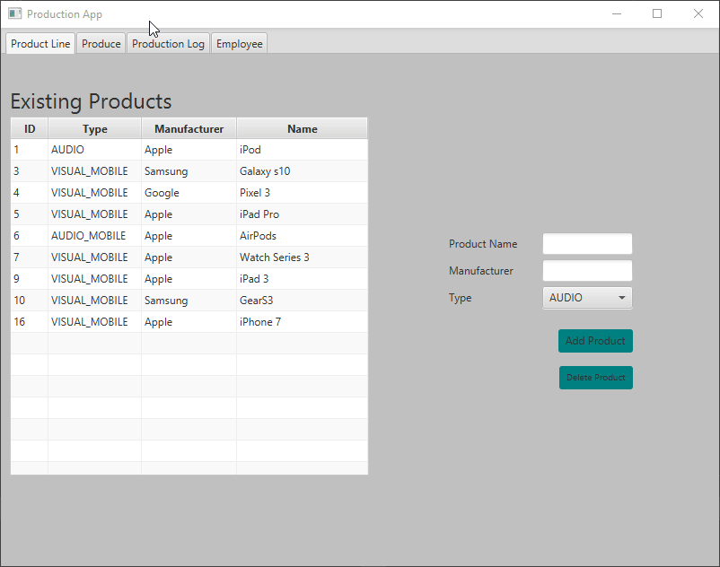
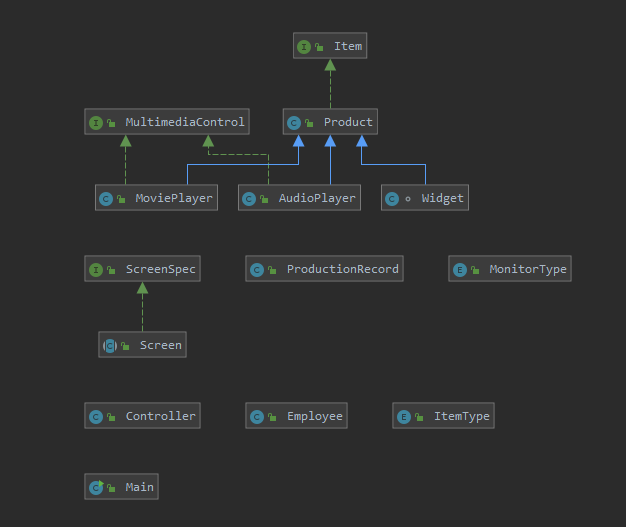
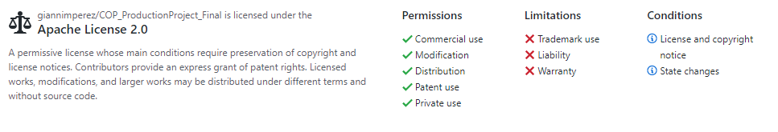

# COP_ProductionProject_Final

This JavaFX program is a simple manufacturer manager with a focus in electronics. This project was made by myself, Gianni M. Perez as part of a semester long project in FGCU's Software Engineering program in the Fall of 2019. It allows a user to create a new product and add it to other existing products. The user can then select a number of a particular product to produce, and recieve a handy production record, with each line cooresponding to an individual item to produce.

## Demonstration

## Documentation
[Javadoc Link!](https://giannimperez.github.io/COP_ProductionProject_Final/index.html)

## Diagrams

## Getting Started
Collaborators using intellij will do the following:
1. Copy clone link on main project page
2. (Using intellij) VCS>Checkout from Version Control>Git>*Paste Url*>Test>Clone
3. Select JDK 1.8
4. Set configuration to application.Main and Apply

## Built With
* Intellij
* Scenebuilder

## Contributing
No noteable contributions other than the instruction and input of Professor Scott Vanselow (Florida Gulf Coast University)

## Author
Gianni M. Perez

## License

## Acknowledgments
* stackoverflow.com
* Professor Vanselow (Florida Gulf Coast University)

## History
* Produced in Fall 2019

## Key Programming Concepts Utilized
* Object Oriented Programming
* Inheritance
* Abstraction
* Implementation
* Overloading constructors

