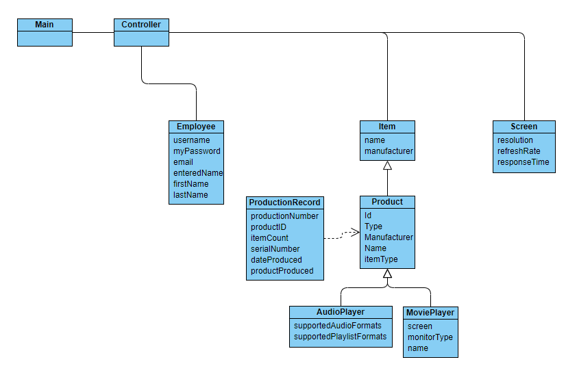

# COP_ProductionProject_Final

## Demonstration

## Documentation
[Javadoc Link!](https://giannimperez.github.io/COP_ProductionProject_Final/index.html)

## Diagrams

## Getting Started
Collaborators using intellij will do the following:
1. Copy clone link on main project page
2. (Using intellij) VCS>Checkout from Version Control>Git>*Paste Url*>Test>Clone
3. Select JDK 1.8
4. Set configuration to application.Main and Apply

## Built With
* Intellij
* Scenebuilder

## Contributing
No noteable contributions other than the instruction and input of Professor Scott Vanselow (Florida Gulf Coast University)

## Author
Gianni M. Perez

## License

## Acknowledgments
* stackoverflow.com
* Professor Vanselow (Florida Gulf Coast University)

## History
* Produced in Fall 2019

## Key Programming Concepts Utilized
Object Oriented Programming
Inheritance
Abstraction
Implementation
Overloading constructors

